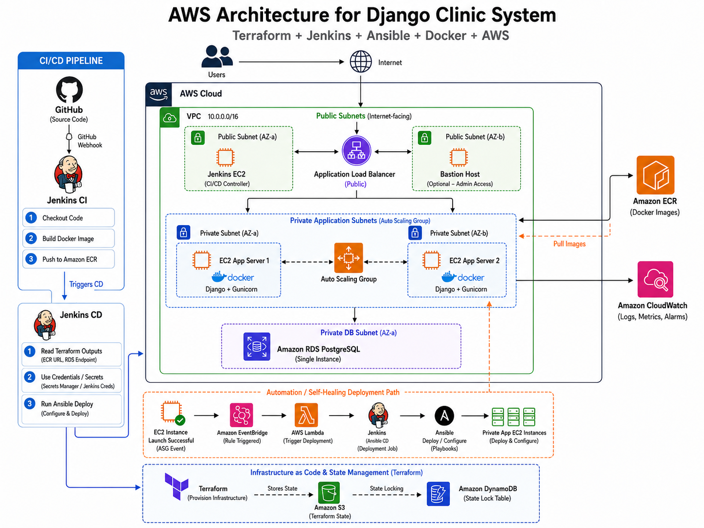
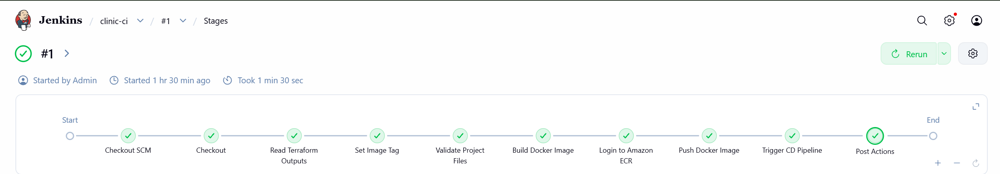
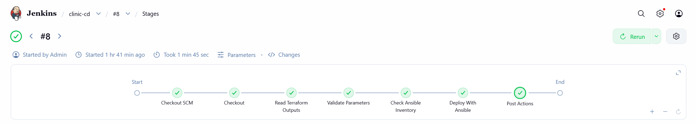
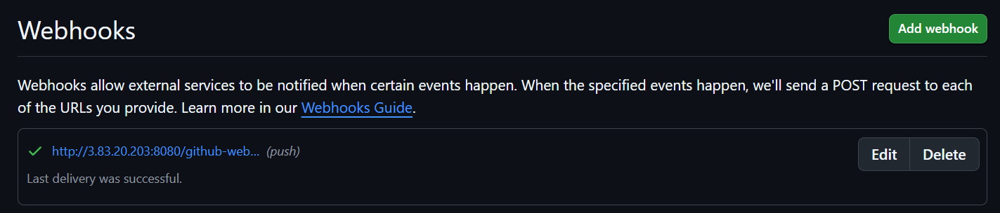
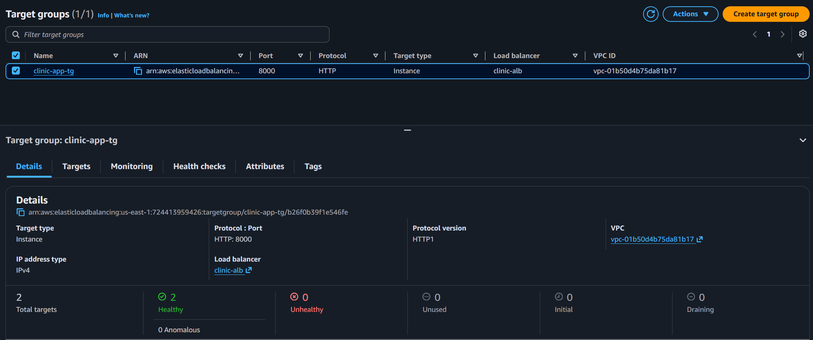
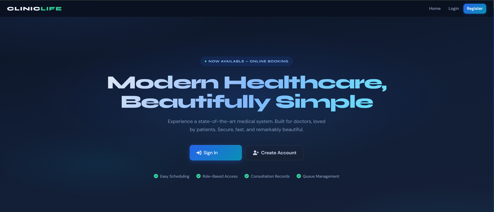

# AWS Clinic Infrastructure Automation

Production-style AWS infrastructure and CI/CD automation for a containerized Django Clinic System using **Terraform, Jenkins, Ansible, Docker, and AWS**.

This project demonstrates a complete DevOps workflow:

- Infrastructure provisioning with Terraform
- Docker image build and push to Amazon ECR
- CI/CD automation with Jenkins
- Server configuration and deployment with Ansible
- Private application deployment behind an Application Load Balancer
- Auto Scaling Group self-healing deployment using EventBridge and Lambda

---

## Architecture Overview



The application runs on private EC2 instances inside an Auto Scaling Group. Users access the app through a public Application Load Balancer. Docker images are stored in Amazon ECR, and Jenkins handles the CI/CD workflow.

The project also includes an automated recovery path: when the Auto Scaling Group launches a new EC2 instance, EventBridge triggers a Lambda function, which triggers the Jenkins CD pipeline to configure and deploy the app to the new instance.

> Note: The current implementation uses a single Amazon RDS PostgreSQL instance.

---

## Tech Stack

| Area | Tools / Services |
|---|---|
| Cloud Provider | AWS |
| Infrastructure as Code | Terraform |
| Configuration Management | Ansible |
| CI/CD | Jenkins |
| Containerization | Docker |
| Image Registry | Amazon ECR |
| Load Balancing | Application Load Balancer |
| Compute | EC2 + Auto Scaling Group |
| Database | Amazon RDS PostgreSQL |
| Monitoring | Amazon CloudWatch |
| Automation | EventBridge + Lambda |
| State Management | S3 Backend + DynamoDB Locking |

---

## Project Structure

```text
.
├── app/
│   └── Django clinic application
│
├── ansible/
│   ├── ansible.cfg
│   ├── requirements.yml
│   ├── inventories/
│   │   ├── aws_ec2.yml
│   │   └── group_vars/
│   │       ├── role_app.yml
│   │       └── role_app.secrets.yml
│   ├── playbooks/
│   │   ├── deploy.yml
│   │   └── setup.yml
│   └── roles/
│       ├── app/
│       └── docker/
│
└── terraform/
    ├── bootstrap/
    ├── modules/
    │   ├── alb
    │   ├── asg
    │   ├── asg-jenkins-trigger
    │   ├── bastion
    │   ├── cloudwatch
    │   ├── ecr
    │   ├── iam
    │   ├── jenkins
    │   ├── launch-template
    │   ├── rds
    │   ├── security-groups
    │   └── vpc
    ├── backend.tf
    ├── main.tf
    ├── outputs.tf
    ├── providers.tf
    ├── variables.tf
    └── terraform.tfvars
```

---

## Infrastructure Components

Terraform provisions the following AWS resources:

- Custom VPC
- Public subnets
- Private application subnets
- Private database subnet
- Internet Gateway
- NAT Gateway
- Route tables
- Security groups
- Bastion host
- Jenkins EC2 server
- Launch Template
- Auto Scaling Group
- Application Load Balancer
- Target Group
- Amazon RDS PostgreSQL
- Amazon ECR repository
- CloudWatch resources
- IAM roles and instance profiles
- S3 backend for Terraform state
- DynamoDB table for Terraform state locking
- EventBridge rule
- Lambda function for ASG-triggered deployments

---

## CI/CD Pipeline

The project uses two Jenkins pipelines:

```text
clinic-ci
clinic-cd
```

### Jenkins CI

The CI pipeline is triggered by a GitHub webhook when changes are pushed or merged into the main branch.

CI responsibilities:

1. Checkout source code
2. Read Terraform outputs
3. Build Docker image
4. Tag image with commit SHA and `latest`
5. Login to Amazon ECR
6. Push Docker image to ECR
7. Trigger the Jenkins CD pipeline



---

### Jenkins CD

The CD pipeline is triggered by either:

- Jenkins CI after a successful image push
- Lambda when the Auto Scaling Group launches a new EC2 instance

CD responsibilities:

1. Checkout repository
2. Read Terraform outputs
3. Load Jenkins credentials
4. Generate runtime Ansible variables
5. Run Ansible deployment playbook
6. Deploy the selected Docker image to private EC2 instances



---

## GitHub Webhook

GitHub is configured to trigger Jenkins automatically through the Jenkins GitHub webhook endpoint.

Flow:

```text
GitHub Push / Merge
        ↓
GitHub Webhook
        ↓
Jenkins CI
        ↓
Docker Build + ECR Push
        ↓
Jenkins CD
        ↓
Ansible Deployment
```



---

## Ansible Deployment

Ansible uses AWS dynamic inventory to discover private EC2 instances by tags.

Ansible responsibilities:

- Discover private app EC2 instances
- Connect through SSH
- Install Docker and AWS CLI
- Create production `.env` file
- Login to Amazon ECR
- Pull the Docker image
- Run Django migrations
- Start or restart the Django container

Main playbooks:

```text
ansible/playbooks/setup.yml
ansible/playbooks/deploy.yml
```

Roles:

```text
ansible/roles/docker
ansible/roles/app
```

---

## Auto Scaling Self-Healing Deployment

The project includes automation for new EC2 instances launched by the Auto Scaling Group.

Flow:

```text
ASG launches new EC2
        ↓
EventBridge detects EC2 Instance Launch Successful
        ↓
Lambda function is triggered
        ↓
Lambda calls Jenkins clinic-cd job
        ↓
Jenkins runs Ansible
        ↓
New EC2 is configured and runs the Django container
```

This ensures that new instances created by the Auto Scaling Group are automatically deployed without manual intervention.

---

## Application Access

Users access the application through the public Application Load Balancer.

```text
User
 ↓
Application Load Balancer
 ↓
Private EC2 App Servers
 ↓
Django Docker Container
 ↓
Amazon RDS PostgreSQL
```

### ALB Healthy Targets



### Application Running



---

## Terraform Remote State

Terraform state is stored remotely using:

- Amazon S3 for state storage
- Amazon DynamoDB for state locking

This prevents local state loss and protects against concurrent Terraform operations.

```text
Terraform
   ↓
S3 Backend
   ↓
DynamoDB Lock Table
```

---

## Security Considerations

The architecture follows basic cloud security practices:

- App EC2 instances are deployed in private subnets
- RDS is private and not publicly accessible
- ALB is the only public entry point for users
- SSH access is restricted through Bastion/Jenkins access rules
- Jenkins credentials are used for sensitive values
- Secrets are not committed to GitHub
- Terraform state locking is enabled
- Security groups restrict traffic between layers

Sensitive values such as the Django `SECRET_KEY`, database password, Jenkins API token, AWS credentials, and private keys are handled outside the repository.

---

## Important Runtime Values

The Jenkins CD pipeline reads runtime values from two sources.

### Terraform Outputs

- ECR repository URL
- RDS endpoint
- RDS port

### Jenkins Credentials

- Django secret key
- Database password
- SSH private key for EC2 access
- Jenkins API token for Lambda-triggered deployment

---

## Deployment Flow

Full deployment flow:

```text
Developer pushes code to GitHub
        ↓
GitHub webhook triggers Jenkins CI
        ↓
Jenkins builds Docker image
        ↓
Jenkins pushes image to Amazon ECR
        ↓
Jenkins triggers CD pipeline
        ↓
CD pipeline runs Ansible
        ↓
Ansible deploys container to private EC2 instances
        ↓
ALB serves the updated Django app
```

---

## Screenshots

### Architecture Diagram


### Jenkins CI Pipeline


### Jenkins CD Pipeline


### GitHub Webhook


### ALB Healthy Targets


### Application Running


---

## Lessons Learned

This project helped me practice:

- Designing secure AWS network architecture
- Writing modular Terraform infrastructure
- Managing Terraform remote state
- Building Docker images in CI
- Pushing images to Amazon ECR
- Deploying containers to private EC2 instances
- Using Ansible dynamic inventory
- Automating deployments with Jenkins
- Handling secrets securely through Jenkins credentials
- Triggering deployments from GitHub webhooks
- Automating ASG instance replacement using EventBridge and Lambda

---

## Final Result

The final system provides an automated DevOps workflow for a Django application on AWS:

```text
Terraform provisions the infrastructure.
Jenkins builds and pushes Docker images.
Ansible deploys the application.
AWS Auto Scaling keeps the app layer available.
EventBridge and Lambda re-trigger deployment for new ASG instances.
CloudWatch provides logs, metrics, and alarms.
```